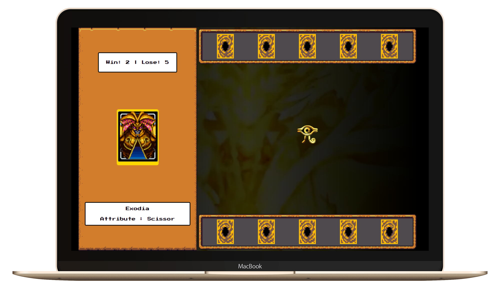

# Entrega de projeto - Criando um Jogo de Cartas do Yu-Gi-Oh! com JavaScript e CSS | DIO

Este projeto tem como objetivo recriar um jogo do Yu-Gi-Oh utilizando as mecânicas de jogo do Jo-Ken-Po (Pedra, Papel e Tesoura). Vamos explorar conceitos avançados de organização de states com JavaScript puro, estruturação de arquivos e criação de funções reaproveitáveis.

## Tecnologias Utilizadas

- HTML: Para estruturar o conteúdo do jogo.
- CSS: Para estilizar e melhorar a aparência do jogo.
- JavaScript: Para implementar a lógica do jogo, gerenciamento de estados e interatividade.

